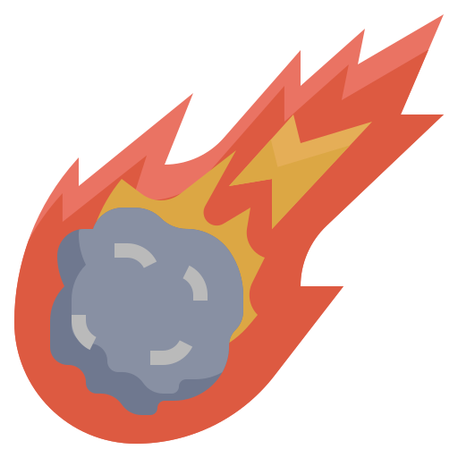

[version-shield]: https://img.shields.io/npm/v/%40rbxts%2Fcomet?style=for-the-badge
[version-url]: https://www.npmjs.com/package/@rbxts/comet?activeTab=versions

[downloads-shield]: https://img.shields.io/npm/d18m/%40rbxts%2Fcomet?style=for-the-badge
[downloads-url]: https://www.npmjs.com/package/@rbxts/comet

[stars-shield]: https://img.shields.io/github/stars/neohertz/comet?style=for-the-badge
[stars-url]: https://github.com/Neohertz/comet/stargazers

[issues-shield]: https://img.shields.io/github/issues/neohertz/comet?style=for-the-badge
[issues-url]: https://github.com/Neohertz/comet/issues

[license-shield]: https://img.shields.io/github/license/neohertz/comet?style=for-the-badge
[license-url]: https://github.com/Neohertz/comet/blob/master/LICENSE

    

<h1 align="center">
	Comet
</h1>

<h4 align="center">
    <b>
        A modular, singleton based framework for building plugins for Roblox Studio.
    </b>
<h4>

[![Downloads][downloads-shield]][downloads-url]
[![Stargazers][stars-shield]][stars-url] 
[![Issues][issues-shield]][issues-url]
[![License][license-shield]][license-url]
[![version][version-shield]][version-url]

    <a href="https://neohertz.github.io/comet/">Learn More →</a>

